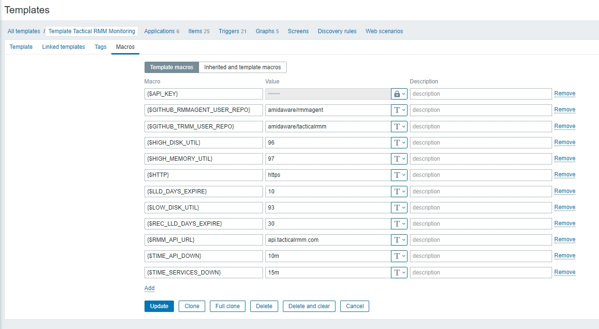
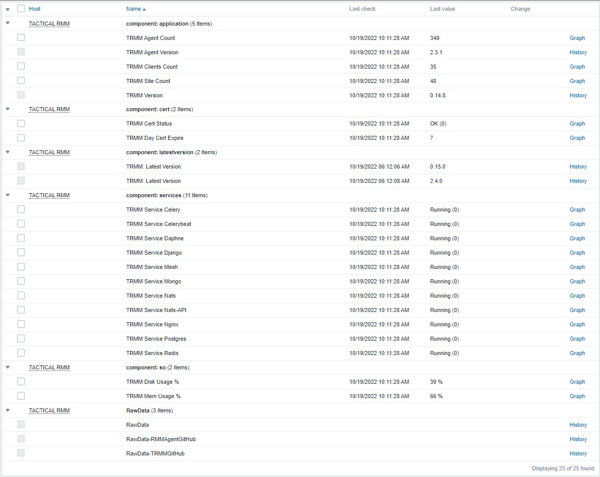
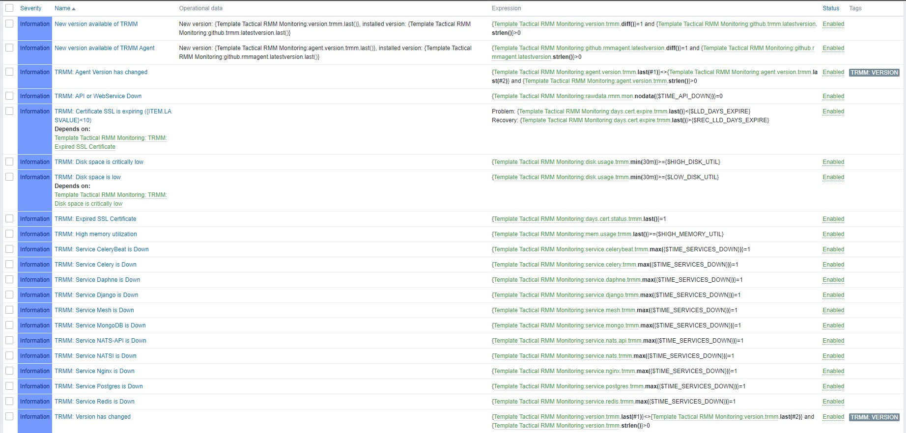

Project Name: TRMM for Zabbix\
Author: Bernardo Lankheet\
Telegram: [@bernardolankheet](https://t.me/bernardolankheet)\
Description EN: Collect Status Metrics on TacticalRMM .

# Prepair your Environment
### Steps:
1. Enable core status on TacticalRmm. On: [TRMM: Tips and Tricks](https://github.com/bernardolankheet/TacticalRMM-Extras/tree/devep/Template-TRMM-for-Zabbix#trmm-tips-and-tricks)
2. Create Zabbix monitoring. On: [Zabbix: Instructions](https://github.com/bernardolankheet/TacticalRMM-Extras/tree/devep/Template-TRMM-for-Zabbix#zabbix-instructions)

## TRMM Tips and Tricks

[TacticalRMM Doc](https://docs.tacticalrmm.com/tipsntricks/#monitor-your-trmm-instance-via-the-built-in-monitoring-endpoint)

### Monitor your TRMM Instance version < v0.20.1 via the Built-in Monitoring Endpoint.
Generate a random string to be used as a token and append it to the bottom of `/rmm/api/tacticalrmm/tacticalrmm/local_settings.py` like this:

```python
MON_TOKEN = "SuperSekretToken123456"
```

Then restart Django to activate the endpoint with `sudo systemctl restart rmm.service`

Send a POST request with the following json payload to `https://api.yourdomain.com/core/status/`
```json
{"auth": "SuperSekretToken123456"}
```

Example using curl:
```
curl -X POST https://api.yourdomain.com/core/status/ -d '{"auth": "SuperSekretToken123456"}' -H 'Content-Type: application/json'
```
Response will look something like this:
```json
{
  "version": "0.14.0",
  "agent_count": 984,
  "client_count": 23,
  "site_count": 44,
  "disk_usage_percent": 12,
  "mem_usage_percent": 36,
  "days_until_cert_expires": 47,
  "cert_expired": false,
  "services_running": {
    "django": true,
    "mesh": true,
    "daphne": true,
    "celery": true,
    "celerybeat": true,
    "redis": true,
    "postgres": true,
    "mongo": true,
    "nats": true,
    "nats-api": true,
    "nginx": true
  }
}
```

### Monitor your TRMM Instance version > v1.0.0 via the Built-in Monitoring Endpoint.
Generate a random string to be used as a token and append it to the bottom of `/rmm/api/tacticalrmm/tacticalrmm/local_settings.py` like this:

```python
MON_TOKEN = "SuperSekretToken123456"
```

Then restart Django to activate the endpoint with `sudo systemctl restart rmm.service`

Send a GET request to https://api.yourdomain.com/core/v2/status/ with the X-Mon-Token header.
```
X-Mon-Token: SuperSekretToken123456
```

Example using curl:
```
curl -H "X-Mon-Token: SuperSekretToken123456" https://api.yourdomain.com/core/v2/status/
```
Response will look something like this:
```json
{
    "version": "1.0.0",
    "latest_agent_version": "2.8.0",
    "agent_count": 345,
    "client_count": 14,
    "site_count":34,
    "disk_usage_percent": 43,
    "mem_usage_percent": 54,
    "days_until_cert_expires": 43,
    "cert_expired": false,
    "redis_ping": true,
    "celery_queue_len": 0,
    "celery_queue_health": "healthy",
    "nats_std_ping": true,
    "nats_ws_ping": true,
    "mesh_ping": true,
    "services_running": {
        "mesh": true,
        "daphne": true,
        "celery": true,
        "celerybeat": true,
        "redis": true,
        "nats": true,
        "nats-api": true
    }
}
```

## Zabbix: Instructions
Tested on Zabbix 5.0 and 7.0

Template Macros:


1. [download](./Template-Tactical-RMM-Monitoring.xml) Zabbix 5.0 and import template to zabbix server (Configuration-->Templates-->Import)

or

[download](./Template-Tactical-RMM-Monitoring-v1-0-0.xml) Zabbix 7.0 and TMM V.1.0.0

2. link template to validator host

3. configure host Macros
   - {$RMM_API_URL}           = Change Tactical API address. **api.tacticalrmm.com**
   - {$API_KEY}               = Change API key, created earlier in this doc, in this example `SuperSekretToken123456`
   - {$HTTP}                  = http or https, default value `https`
   - {$TIME_API_DOWN}         = Used on Trigger **TRMM: API or WebService Down**, value default: `10m`
   - {$TIME_SERVICES_DOWN}    = Used on Trigger **TRMM: Service XXXXXX is Down**, value default: `15m`
   - {$LLD_DAYS_EXPIRE}       = Used on Trigger **TRMM: Certificate SSL is expiring ({ITEM.LASVALUE}<{$LLD_DAYS_EXPIRE})**, value default: `10` days
   - {$LOW_DISK_UTIL}         = Used on Trigger **TRMM: Disk space is XXXXX**, value default: `93`
   - {$HIGH_MEMORY_UTIL}      = Used on Trigger **TRMM: High memory utilization**, value default: `97`

4. Wait for collection time

### some screenshots
***monitoring values***



***triggers***




Obs: **Change macros, intervals and triggers according to your environment.**